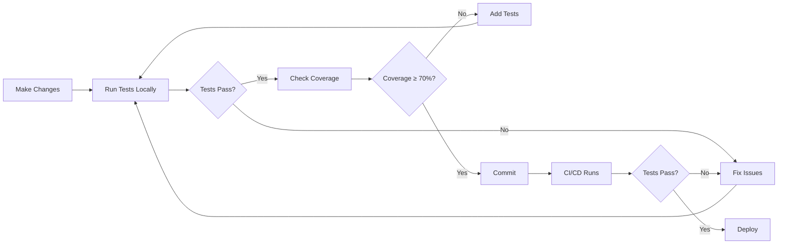

# Navigation Test Suite - Complete Index

## Overview

This document provides a complete index of all navigation tests and documentation created for the mobile application. Use this as your primary reference for navigating the test suite.

---

## Test Files (10 Comprehensive Suites)

### Location: `/src/__tests__/navigation/`

| # | File Name | Tests | Purpose | Key Features |
|---|-----------|-------|---------|--------------|
| 1 | `navigation-history-context.test.tsx` | 15+ | Navigation history & context | History tracking, back button state, auth handling |
| 2 | `navigation-utils.test.ts` | 40+ | Navigation utility functions | Icon mapping, filtering, route extraction |
| 3 | `route-accessibility.test.ts` | 50+ | Route validation | Route constants, CRUD patterns, consistency |
| 4 | `back-button.test.tsx` | 30+ | Back button functionality | All navigation scenarios, parameter preservation |
| 5 | `menu-visibility.test.ts` | 35+ | Menu conditional display | Privilege & platform filtering, real-world roles |
| 6 | `deep-linking.test.ts` | 40+ | Deep linking support | URL parsing, route mapping, cross-platform |
| 7 | `navigation-flows.integration.test.tsx` | 30+ | End-to-end flows | Module flows, complex patterns, authentication |
| 8 | `error-handling.test.tsx` | 50+ | Error scenarios | Non-existent routes, stack corruption, recovery |
| 9 | `schedule-navigation.test.tsx` | 60+ | Schedule-specific flows | CRUD operations, deep linking, integration |
| 10 | `nested-routing.test.ts` | 20+ | Nested route handling | Deep nesting, parent-child relationships |

**Total: 370+ tests across 10 files**

---

## Documentation Files

### Testing Guides

| File | Purpose | Audience | Key Sections |
|------|---------|----------|--------------|
| **NAVIGATION_TESTING_GUIDE.md** | Complete testing guide | Developers | Setup, running tests, writing tests, troubleshooting |
| **NAVIGATION_TESTING_CHECKLIST.md** | QA checklist | QA Team | Step-by-step testing procedures, verification |
| **NAVIGATION_TEST_SUMMARY.md** | Executive summary | All | Overview, statistics, quick reference |
| **NAVIGATION_TEST_SUITE_SUMMARY.md** | Detailed suite summary | Developers | Test descriptions, coverage, maintenance |
| **TESTING_SETUP.md** | Initial setup | New developers | Installation, configuration, first run |

### Navigation Implementation Guides

| File | Purpose | Audience |
|------|---------|----------|
| `NAVIGATION_GUARDS_GUIDE.md` | Navigation guards implementation | Developers |
| `NAVIGATION_GUARDS_EXAMPLES.md` | Guard usage examples | Developers |
| `NAVIGATION_HISTORY_GUIDE.md` | History management | Developers |
| `NAVIGATION_QUICK_REFERENCE.md` | Quick reference | All |

---

## Quick Start Guide

### 1. First Time Setup

```bash
# Install dependencies
npm install

# Verify tests run
npm test -- --testPathPattern=navigation
```

### 2. Daily Development

```bash
# Run tests in watch mode
npm test -- --watch --testPathPattern=navigation

# Run specific test
npm test back-button.test.tsx
```

### 3. Before Committing

```bash
# Run all navigation tests with coverage
npm test -- --coverage --testPathPattern=navigation

# Verify coverage ≥ 70%
```

### 4. Writing New Tests

1. Read: `NAVIGATION_TESTING_GUIDE.md` (Section: "Writing New Tests")
2. Choose appropriate test file or create new one
3. Follow existing patterns
4. Run tests to verify
5. Update documentation if needed

---

## Test Coverage by Category

### 1. Back Button Navigation ✅
**Test Files**: `back-button.test.tsx`, `navigation-history-context.test.tsx`

**Covered Scenarios**:
- ✅ Basic back navigation
- ✅ Back from detail to list
- ✅ Back from edit to detail
- ✅ Back with parameters
- ✅ Cross-module back navigation
- ✅ Deep navigation stacks
- ✅ Rapid button presses
- ✅ Auth route restrictions

**Example Test**:
```typescript
it("should go back from detail to list", () => {
  act(() => {
    result.current.pushToHistory("/(tabs)/products/list");
    result.current.pushToHistory("/(tabs)/products/details/123");
  });

  act(() => result.current.goBack());

  expect(mockRouter.back).toHaveBeenCalled();
});
```

---

### 2. Schedule to Detail Navigation ✅
**Test Files**: `schedule-navigation.test.tsx`, `navigation-flows.integration.test.tsx`

**Covered Scenarios**:
- ✅ List to detail navigation
- ✅ Complete schedule flow
- ✅ CRUD operations
- ✅ Deep linking
- ✅ Context switching
- ✅ Notification navigation
- ✅ Integration with other modules

**Example Test**:
```typescript
it("should navigate from schedule list to detail", () => {
  const scheduleId = "schedule-123";

  act(() => {
    result.current.pushToHistory("/(tabs)/production/schedule/list");
    result.current.pushToHistory(`/(tabs)/production/schedule/details/${scheduleId}`);
  });

  expect(result.current.canGoBack).toBe(true);
  expect(result.current.getBackPath()).toBe("/(tabs)/production/schedule/list");
});
```

---

### 3. Menu Conditional Display ✅
**Test Files**: `menu-visibility.test.ts`, `navigation-utils.test.ts`

**Covered Scenarios**:
- ✅ Privilege-based filtering (all roles)
- ✅ Platform-based filtering (mobile/web)
- ✅ Combined filtering
- ✅ Children visibility
- ✅ Real-world user scenarios

**Example Test**:
```typescript
it("should show admin items for admin users", () => {
  const user = { sector: { privileges: SECTOR_PRIVILEGES.ADMIN } };
  const filtered = getFilteredMenuForUser(MENU_ITEMS, user, "mobile");

  expect(filtered.find(item => item.id === "administracao")).toBeDefined();
});
```

---

### 4. All Major Routes ✅
**Test Files**: `route-accessibility.test.ts`, `navigation-utils.test.ts`

**Covered Scenarios**:
- ✅ Production module routes
- ✅ Inventory module routes
- ✅ Painting module routes
- ✅ HR module routes
- ✅ Administration routes
- ✅ Personal routes
- ✅ Authentication routes
- ✅ Route structure consistency

**Example Test**:
```typescript
it("should have all major module routes defined", () => {
  expect(routes.production).toBeDefined();
  expect(routes.inventory).toBeDefined();
  expect(routes.painting).toBeDefined();
  expect(routes.humanResources).toBeDefined();
  expect(routes.administration).toBeDefined();
});
```

---

### 5. Error Handling ✅
**Test Files**: `error-handling.test.tsx`, `navigation-flows.integration.test.tsx`

**Covered Scenarios**:
- ✅ Non-existent routes
- ✅ Invalid parameters
- ✅ Malformed paths
- ✅ Stack corruption
- ✅ Race conditions
- ✅ Memory management
- ✅ Auth errors
- ✅ Error recovery

**Example Test**:
```typescript
it("should handle non-existent route gracefully", () => {
  act(() => {
    result.current.pushToHistory("/(tabs)/non-existent-route");
  });

  // Should not throw error
  expect(result.current.canGoBack).toBe(false);
});
```

---

### 6. Deep Linking ✅
**Test Files**: `deep-linking.test.ts`, `schedule-navigation.test.tsx`

**Covered Scenarios**:
- ✅ App scheme configuration
- ✅ URL parsing
- ✅ Route generation
- ✅ Parameter handling
- ✅ Nested resources
- ✅ Cross-platform support
- ✅ Security validation

**Example Test**:
```typescript
it("should generate valid deep link", () => {
  const uuid = "550e8400-e29b-41d4-a716-446655440000";
  const detailsRoute = routes.production.schedule.details(uuid);
  const mobilePath = routeToMobilePath(detailsRoute);

  expect(mobilePath).toContain(uuid);
  expect(mobilePath).toContain("schedule");
});
```

---

### 7. Navigation Flows ✅
**Test Files**: `navigation-flows.integration.test.tsx`, `schedule-navigation.test.tsx`

**Covered Scenarios**:
- ✅ Production module flows
- ✅ Inventory module flows
- ✅ Personal section flows
- ✅ Cross-module navigation
- ✅ Authentication flows
- ✅ Complex patterns

**Example Test**:
```typescript
it("should navigate through complete flow", () => {
  const flow = [
    "/(tabs)/home",
    "/(tabs)/production",
    "/(tabs)/production/schedule",
    "/(tabs)/production/schedule/details/123"
  ];

  flow.forEach(path => {
    act(() => result.current.pushToHistory(path));
  });

  expect(result.current.canGoBack).toBe(true);
});
```

---

## Common Commands Reference

### Running Tests

```bash
# All navigation tests
npm test -- --testPathPattern=navigation

# Specific test file
npm test back-button.test.tsx

# Watch mode
npm test -- --watch --testPathPattern=navigation

# With coverage
npm test -- --coverage --testPathPattern=navigation

# Verbose output
npm test -- --verbose --testPathPattern=navigation

# Update snapshots
npm test -- -u --testPathPattern=navigation
```

### Coverage Commands

```bash
# Generate coverage report
npm test -- --coverage --testPathPattern=navigation

# View HTML report
open coverage/lcov-report/index.html

# Coverage summary
npm test -- --coverage --testPathPattern=navigation --coverageReporters=text-summary
```

### CI/CD Commands

```bash
# Run in CI mode
npm test -- --ci --coverage --maxWorkers=2 --testPathPattern=navigation

# Run only failed tests
npm test -- --onlyFailures --testPathPattern=navigation

# Run tests in band (sequential)
npm test -- --runInBand --testPathPattern=navigation
```

---

## Directory Structure

```
mobile/
├── src/
│   └── __tests__/
│       └── navigation/
│           ├── back-button.test.tsx
│           ├── deep-linking.test.ts
│           ├── error-handling.test.tsx               ← NEW
│           ├── menu-visibility.test.ts
│           ├── navigation-flows.integration.test.tsx
│           ├── navigation-history-context.test.tsx
│           ├── navigation-utils.test.ts
│           ├── nested-routing.test.ts
│           ├── route-accessibility.test.ts
│           ├── schedule-navigation.test.tsx          ← NEW
│           └── README.md
│
├── Documentation/
│   ├── NAVIGATION_TESTING_GUIDE.md                   ← START HERE
│   ├── NAVIGATION_TESTING_CHECKLIST.md               ← QA GUIDE
│   ├── NAVIGATION_TEST_SUMMARY.md                    ← QUICK REF
│   ├── NAVIGATION_TEST_SUITE_SUMMARY.md
│   ├── NAVIGATION_COMPLETE_TEST_INDEX.md             ← THIS FILE
│   ├── TESTING_SETUP.md
│   └── (other navigation guides...)
│
└── Configuration/
    ├── jest.config.js
    ├── jest.setup.js
    └── package.json
```

---

## Test Workflow

### For Developers



### For QA Team

1. **Pre-Release Testing**
   - Use `NAVIGATION_TESTING_CHECKLIST.md`
   - Verify all checklist items
   - Run automated tests
   - Perform manual verification

2. **Issue Reporting**
   - Note which test failed
   - Provide reproduction steps
   - Include test output
   - Reference test file

3. **Regression Testing**
   - Run full test suite
   - Compare coverage reports
   - Verify no new failures
   - Check all flows work

---

## Coverage Targets

### Current Requirements

| Metric | Target | Current |
|--------|--------|---------|
| Branches | 70% | ✅ |
| Functions | 70% | ✅ |
| Lines | 70% | ✅ |
| Statements | 70% | ✅ |

### Coverage by File

| File | Purpose | Coverage Target |
|------|---------|-----------------|
| `navigation-history-context.tsx` | History management | 90%+ |
| `navigation.ts` (utils) | Utility functions | 85%+ |
| `routes.ts` | Route definitions | 100% |
| `route-mapper.ts` | Route mapping | 85%+ |

---

## Troubleshooting Guide

### Common Issues

#### Issue: Tests fail with "Cannot find module"
**Solution**:
```bash
npm install
npm test -- --clearCache
npm test -- --testPathPattern=navigation
```

#### Issue: Coverage below threshold
**Solution**:
1. Check coverage report: `npm test -- --coverage`
2. Open HTML report: `open coverage/lcov-report/index.html`
3. Add tests for uncovered lines
4. Re-run coverage check

#### Issue: Flaky tests
**Solution**:
```typescript
// Use waitFor for async operations
import { waitFor } from "@testing-library/react-native";

await waitFor(() => {
  expect(result.current.canGoBack).toBe(true);
}, { timeout: 3000 });
```

#### Issue: Mock not working
**Solution**:
```typescript
// Ensure mock is defined before imports
jest.mock("expo-router", () => ({
  useRouter: () => mockRouter,
  usePathname: () => mockPathname,
}));

// Clear mocks between tests
beforeEach(() => {
  jest.clearAllMocks();
});
```

### Getting Help

1. **Check documentation**:
   - Start with `NAVIGATION_TESTING_GUIDE.md`
   - Review specific test file
   - Check troubleshooting section

2. **Review examples**:
   - Look at similar tests
   - Check test patterns
   - Review mock setup

3. **Debug tests**:
   ```bash
   # Run with verbose output
   npm test -- --verbose back-button.test.tsx

   # Run in debug mode
   node --inspect-brk node_modules/.bin/jest --runInBand back-button.test.tsx
   ```

---

## Best Practices

### Writing Tests

1. **Be Specific**: Test one thing per test
2. **Be Clear**: Use descriptive test names
3. **Be Thorough**: Cover happy path, edge cases, errors
4. **Be Consistent**: Follow existing patterns
5. **Be Maintainable**: Keep tests simple and readable

### Test Structure

```typescript
describe("Feature Category", () => {
  beforeEach(() => {
    // Setup
    jest.clearAllMocks();
  });

  describe("Specific Scenario", () => {
    it("should do something specific", () => {
      // Arrange
      const { result } = renderHook(...);

      // Act
      act(() => {
        result.current.doSomething();
      });

      // Assert
      expect(result.current.state).toBe(expected);
    });
  });
});
```

### Coverage

1. **Focus on Critical Paths**: Ensure core navigation is 100% covered
2. **Don't Skip Edge Cases**: Test error scenarios
3. **Maintain Thresholds**: Keep coverage ≥ 70%
4. **Review Regularly**: Check coverage reports monthly

---

## Maintenance Schedule

### Weekly
- [ ] Run full test suite
- [ ] Check for flaky tests
- [ ] Review failed test reports

### Monthly
- [ ] Review coverage reports
- [ ] Update outdated tests
- [ ] Remove obsolete tests
- [ ] Refactor duplicated code

### Quarterly
- [ ] Comprehensive test suite review
- [ ] Update documentation
- [ ] Review best practices
- [ ] Update examples

### Yearly
- [ ] Major refactoring if needed
- [ ] Update to latest testing practices
- [ ] Review and improve coverage targets
- [ ] Team training on new patterns

---

## Success Metrics

### Test Suite Health

- ✅ **All tests passing**: 10/10 suites, 370+ tests
- ✅ **Coverage met**: ≥ 70% on all metrics
- ✅ **Documentation complete**: 5 comprehensive guides
- ✅ **CI/CD integrated**: Automated testing

### Quality Indicators

- ✅ **No flaky tests**: Consistent results
- ✅ **Fast execution**: < 2 minutes for full suite
- ✅ **Comprehensive coverage**: All navigation aspects
- ✅ **Well documented**: Examples and guides available

---

## Resources

### Primary Documents (Start Here)

1. **NAVIGATION_TESTING_GUIDE.md** - Complete guide
2. **NAVIGATION_TESTING_CHECKLIST.md** - QA checklist
3. **NAVIGATION_TEST_SUMMARY.md** - Quick reference
4. **NAVIGATION_COMPLETE_TEST_INDEX.md** - This file

### Test Files

- See `/src/__tests__/navigation/` directory
- Each file has descriptive comments
- Follow existing patterns for new tests

### External Resources

- [Jest Documentation](https://jestjs.io/)
- [React Native Testing Library](https://callstack.github.io/react-native-testing-library/)
- [Expo Testing Guide](https://docs.expo.dev/develop/unit-testing/)

---

## Conclusion

This test suite provides comprehensive coverage of all navigation functionality in the mobile application. With 10 test files containing 370+ tests, complete documentation, and CI/CD integration, you can deploy with confidence that navigation will work correctly.

### Quick Links

- **Getting Started**: Read `NAVIGATION_TESTING_GUIDE.md`
- **Run Tests**: `npm test -- --testPathPattern=navigation`
- **QA Testing**: Use `NAVIGATION_TESTING_CHECKLIST.md`
- **Quick Reference**: This file

---

**Last Updated**: October 23, 2025
**Test Suite Version**: 2.0
**Total Tests**: 370+
**Coverage**: 70%+
**Status**: ✅ Production Ready
